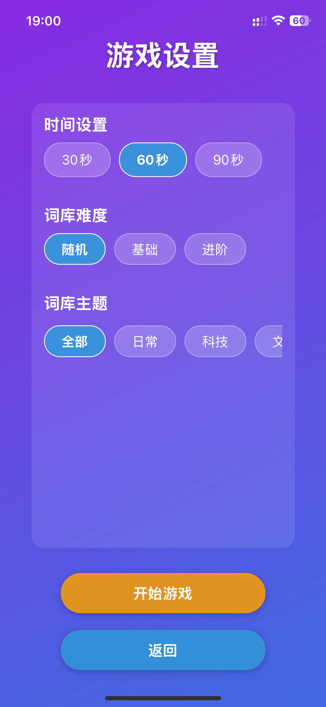
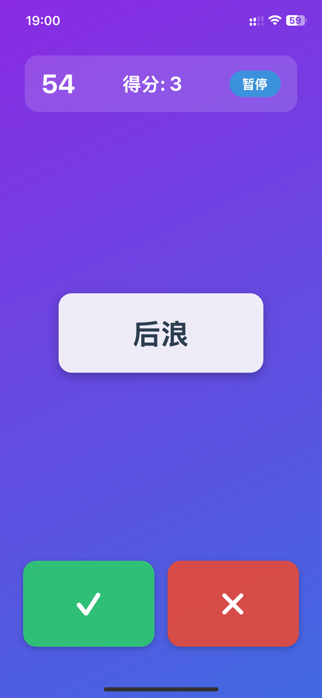

# 疯狂猜词 (Crazy Word Guess)


一款基于React Native与Expo构建的多人派对游戏应用，支持多种主题和难度的词语猜测游戏。

<p align="center">
  
</p>

## 📖 项目简介

"疯狂猜词"是一款适合团队建设和社交聚会的互动游戏。玩家轮流扮演猜词者，其他玩家通过语言或肢体动作描述屏幕上的词语，猜词者需要基于提示猜出正确答案。游戏集趣味性与挑战性于一体，提供沉浸式的多人游戏体验。

## ✨ 核心功能

- **丰富词库** - 400+精选词语，覆盖8大主题领域
- **多级难度** - 支持基础、进阶和随机难度选择
- **自定义时长** - 可选30/60/90秒游戏时长
- **游戏控制** - 支持暂停/继续，可中途结束查看结果
- **成绩统计** - 详细记录正确/错误词语列表
- **排行系统** - 支持本地与在线排行榜，记录个人最佳成绩

## 🛠️ 技术架构

- **前端框架**: React Native
- **开发工具**: Expo
- **路由导航**: React Navigation
- **开发语言**: TypeScript
- **状态管理**: React Hooks
- **数据存储**: 本地存储 + 模拟在线API

## 📱 应用截图

以下是游戏的主要界面截图：

<p align="center">
  
  
  
</p>

<p align="center">
  
  
</p>

<p align="center">
  
  
</p>

### 游戏主要界面

下面简要介绍每个页面的功能:

- **欢迎页面**: 展示游戏标题并提供"开始游戏"、"规则说明"和"查看排行榜"按钮
- **设置页面**: 可选择游戏时长(30/60/90秒)、词库难度(随机/基础/进阶)和词库主题
- **游戏页面**: 显示当前词语、计时器、分数，以及"正确"、"跳过"按钮
- **结果页面**: 展示本局游戏得分、正确/错误词语列表，以及保存成绩选项
- **规则页面**: 详细说明游戏规则与玩法
- **排行榜页面**: 支持查看本地和全球最佳成绩排名

## 🚀 快速开始

### 前置要求

- Node.js (v12.0+)
- npm 或 yarn
- Expo CLI

### 安装步骤

```bash
# 克隆仓库
git clone https://github.com/yourusername/CrazyWordGuess.git

# 进入项目目录
cd CrazyWordGuess

# 安装依赖
npm install
# 或
yarn install

# 启动开发服务器
npm start
# 或
expo start
```

### 构建与部署

```bash
# Web版本构建
npm run web-build

# iOS构建
expo build:ios

# Android构建
expo build:android
```

## 📋 游戏说明

1. **游戏设置**:
   - 选择游戏时长(30/60/90秒)
   - 选择词库难度(随机/基础/进阶)
   - 选择词库主题(全部/日常/科技/文学等)

2. **游戏流程**:
   - 一名玩家担任猜词者，持有设备但不查看屏幕
   - 其他玩家看到屏幕上的词语，通过描述帮助猜词者
   - 猜对点击"✓"，错误点击"✗"
   - 计时结束或通过暂停菜单提前结束游戏

3. **结果记录**:
   - 查看本局游戏得分
   - 浏览正确与错误的词语列表
   - 输入名字保存成绩到排行榜
   - 查看历史最佳成绩与全球排名

## 🔄 最近更新

### v1.0.0 (2023-05-20)

- **游戏控制升级**:
  - 新增游戏暂停/继续功能
  - 支持中途结束并保存成绩
  - 优化导航堆栈，解决返回逻辑混乱问题

- **排行榜系统**:
  - 实现玩家名称注册与成绩保存
  - 添加本地/在线排行榜切换功能
  - 按分数高低智能排序与展示

- **内容扩充**:
  - 词库总量扩充至400+
  - 新增流行语与网络梗词库
  - 实现基于主题的词库过滤

## 🤝 参与贡献

欢迎参与本项目的开发和改进！

1. Fork 本仓库
2. 创建功能分支 (`git checkout -b feature/AmazingFeature`)
3. 提交更改 (`git commit -m 'Add some AmazingFeature'`)
4. 推送到分支 (`git push origin feature/AmazingFeature`)
5. 创建 Pull Request

## 📝 开发计划

- [ ] 添加多人在线对战功能
- [ ] 实现自定义词库创建与分享
- [ ] 增加音效与动画效果
- [ ] 支持深色模式
- [ ] 添加成就系统

## 📄 许可证

本项目采用 MIT 许可证 - 详见 [LICENSE](LICENSE) 文件

## 👥 团队成员

- **开发者** - [Yixin(Charles) Zhang](https://github.com/sszdhlh)
- **设计师** - Claude & Yixin(Charles) Zhang

## 🙏 致谢

- 感谢所有为项目提供反馈和建议的用户
- [React Native 社区](https://reactnative.dev/)
- [Expo 团队](https://expo.dev/)

---

<p align="center">
  Made with ❤️ for word game enthusiasts
</p> 